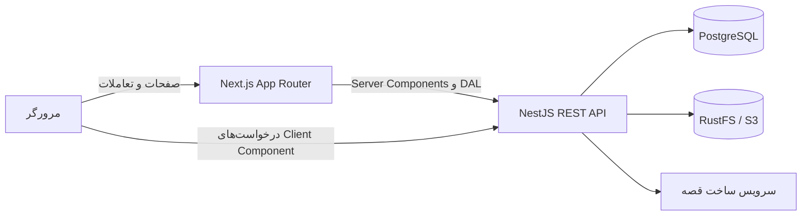

# فرانت‌اند شهرزاد قصه‌گو

رابط فارسی و راست‌به‌چپ سامانه «شهرزاد قصه‌گو»؛ یک اپلیکیشن Next.js برای ساخت قصه و ویدیوی شخصی‌سازی‌شده برای کودکان. این پروژه سایت عمومی، حساب والدین، فرایند ساخت و پرداخت قصه و پنل عملیاتی مدیران را در یک App Router ارائه می‌کند و داده‌ها را از REST API پروژه بک‌اند می‌گیرد.

مستندات API، پایگاه داده و سرویس تولید در [README بک‌اند](../scene-generator-backend/README.md) قرار دارد. اجرای کانتینری کل سامانه نیز با `docker-compose.yml` ریشه repository انجام می‌شود.

## امکانات

### سایت عمومی و حساب کاربری

- صفحه اصلی، معرفی ویژگی‌ها، نحوه کار، قیمت‌ها، پرسش‌های متداول و تماس
- صفحات شرایط استفاده و حریم خصوصی
- ثبت‌نام والد با شماره موبایل، گذرواژه و نام اختیاری
- ورود با شماره موبایل و گذرواژه
- تغییر اجباری گذرواژه پس از بازنشانی توسط مدیر
- حالت روشن/تیره، طراحی واکنش‌گرا و رابط RTL فارسی

### پنل والدین

- داشبورد خانوادگی و ادامه خواندن آخرین قصه
- ساخت و مدیریت پرونده کودکان ۳ تا ۱۲ سال
- ثبت علایق، تصویر خصوصی کودک و تنظیمات پیش‌فرض قصه
- ویزارد ساخت قصه با موضوع اخلاقی یا ایده دلخواه، لحن، طول، سبک تصویر و صدای راوی
- افزودن حداکثر چهار شخصیت جانبی و استفاده دوباره از شخصیت‌های ذخیره‌شده
- پرداخت آزمایشی محلی یا هدایت به لینک درگاه
- نمایش مرحله‌ای پیشرفت ساخت: شناخت شخصیت، نوشتن، تصویرسازی، روایت و صحافی
- کتابخانه قصه‌ها با جست‌وجو و فیلتر، علاقه‌مندی‌ها و ادامه خواندن
- خواندن صفحه‌ای قصه، پخش و دانلود ویدیوی خصوصی
- صورت‌حساب، جزئیات تراکنش و نسخه چاپی فاکتور
- اعلان‌ها، تنظیمات حساب، نشست‌های فعال، خروج از دستگاه‌ها و خروج از همه دستگاه‌ها
- دریافت خروجی JSON از داده‌های حساب یا هر کودک و حذف حساب با تأیید گذرواژه

### پنل مدیریت

- داشبورد شاخص‌های عملیاتی، گزارش‌ها و خروجی CSV
- مدیریت و مشاهده کاربران و پرونده‌های کودکان
- ساخت Admin توسط SuperAdmin، تعلیق/فعال‌سازی کاربر و بازنشانی گذرواژه
- مشاهده قصه‌ها، صف تولید، جزئیات jobها و اجرای دوباره قصه ناموفق
- بازبینی محتوای علامت‌گذاری‌شده و ثبت تصمیم مدیر
- گزارش مصرف مراحل تولید، پرداخت‌ها و وضعیت سفارش‌ها
- گزارش رخدادهای حسابرسی و تنظیمات ظرفیت، ایمنی محتوا و نگه‌داری داده

## فناوری‌ها

| بخش | فناوری |
| --- | --- |
| چارچوب | Next.js 16.3، App Router و React 19.2 |
| زبان | TypeScript 5 با حالت strict |
| استایل | Tailwind CSS 4 و CSS variables |
| رابط | Radix Direction، Lucide و کامپوننت‌های داخلی |
| تست | Jest، React Testing Library و Playwright |
| استقرار | خروجی Next.js Standalone و Docker چندمرحله‌ای |

حداقل نسخه Node.js موردنیاز Next.js فعلی `20.9.0` است؛ Node.js 22 پیشنهاد می‌شود و با Dockerfile پروژه یکسان است.

## معماری



- مسیرهای `app/(public)` بدون ورود، `app/(auth)` مخصوص ورود و ثبت‌نام، `app/(app)` مخصوص والد و `app/(admin)` مخصوص مدیر هستند. Route Groupها در URL ظاهر نمی‌شوند.
- صفحات و layoutها تا جای ممکن Server Component هستند. فرم‌ها، dialogها، منوها و رفتارهای تعاملی Client Component باقی مانده‌اند.
- `lib/api.ts` کلاینت مشترک fetch است. درخواست‌ها `credentials: include`، `cache: no-store` و خطاهای استاندارد `ApiError` دارند.
- در مرورگر از `NEXT_PUBLIC_API_URL` و در اجرای سمت سرور، در صورت تنظیم، از `INTERNAL_API_URL` استفاده می‌شود. این تفکیک برای شبکه داخلی Docker مهم است.
- `proxy.ts` فقط با دیدن کوکی‌ها هدایت سریع و خوش‌بینانه انجام می‌دهد. کنترل معتبر نشست و نقش در `lib/dal.ts` با `GET /auth/me` و در نهایت در Guardهای بک‌اند انجام می‌شود.
- state manager سراسری در پروژه وجود ندارد؛ داده‌های سروری هنگام render دریافت می‌شوند و state فرم‌ها و تعاملات به‌صورت محلی مدیریت می‌شود.

## ساختار پروژه

```text
scene-generator-front/
├── app/
│   ├── (public)/          # سایت معرفی و پرداخت mock
│   ├── (auth)/            # ورود، ثبت‌نام و تغییر گذرواژه
│   ├── (app)/             # پنل والدین
│   └── (admin)/           # پنل مدیریت
├── components/
│   ├── public/            # اجزای سایت عمومی
│   ├── app/               # اجزای پنل والدین
│   └── admin/             # اجزای پنل مدیریت
├── lib/                   # API client، DAL، typeها و helperها
├── public/                # لوگو و تصاویر موضوع‌های قصه
├── proxy.ts               # هدایت اولیه بر اساس نشست و نقش
├── next.config.ts         # standalone output و auth interrupts
├── Dockerfile
└── playwright.config.ts
```

## اجرای سریع کل سامانه با Docker Compose

فایل Compose در ریشه repository قرار دارد و PostgreSQL، RustFS، migration/seed، بک‌اند و فرانت‌اند را با ترتیب درست اجرا می‌کند:

```bash
cd ..
cp .env.example .env
# secretها و اطلاعات مدیر را در .env تغییر دهید
docker compose up --build -d
docker compose ps
```

سپس فرانت در `http://localhost:3000` و Swagger بک‌اند در `http://localhost:3001/api/docs` در دسترس است.

```bash
# مشاهده لاگ برنامه‌ها
docker compose logs -f frontend backend migrate

# توقف stack با حفظ داده‌های PostgreSQL و RustFS
docker compose down
```

سرویس one-shot به نام `migrate` قبل از بک‌اند migrationها و seed تنظیمات، نقش‌ها و SuperAdmin را اجرا می‌کند. تغییر متغیرهای `NEXT_PUBLIC_*` به rebuild فرانت نیاز دارد:

```bash
docker compose up --build -d frontend
```

## راه‌اندازی محلی بدون کانتینری‌کردن فرانت

پیش‌نیازها:

- Node.js `>= 20.9.0`؛ نسخه 22 پیشنهاد می‌شود
- npm
- بک‌اند در دسترس روی پورت 3001 یا URL تنظیم‌شده

ابتدا بک‌اند و dependencyهای آن را طبق README بک‌اند اجرا کنید. سپس:

```bash
cd scene-generator-front
cp .env.local.example .env.local
npm ci
npm run dev
```

برنامه در `http://localhost:3000` در دسترس است. API پیش‌فرض نیز باید در `http://localhost:3001/api` پاسخ بدهد.

برای اجرای build تولیدی بدون Docker:

```bash
npm run build
npm run start
```

## متغیرهای محیطی

برای اجرای Node محلی، فایل `.env.local.example` را کپی کنید. Compose از `.env.example` ریشه استفاده می‌کند. متغیرهای `NEXT_PUBLIC_*` عمومی‌اند و نباید حاوی secret باشند.

| متغیر | زمان مصرف | توضیح | مقدار محلی پیشنهادی |
| --- | --- | --- | --- |
| `NEXT_PUBLIC_API_URL` | build و مرورگر | آدرس عمومی REST API با پیشوند `/api` | `http://localhost:3001/api` |
| `INTERNAL_API_URL` | runtime سمت سرور | آدرس داخلی API برای Server Componentها؛ Compose آن را روی `http://backend:3001/api` می‌گذارد | همان API یا نام سرویس Docker |
| `NEXT_PUBLIC_PAYMENT_MODE` | build | با مقدار `link` صفحه پرداخت mock را غیرفعال می‌کند؛ باید با `PAYMENT_MODE` بک‌اند هماهنگ باشد | `mock` |
| `NEXT_PUBLIC_SITE_URL` | build | مبدأ عمومی سایت برای لینک کامل تصویر اشتراک‌گذاری اجتماعی | آدرس production سایت |
| `NEXT_PUBLIC_S3_URL` | build | در نمونه env و build args نگه داشته شده، اما کد فعلی رسانه خصوصی را از API stream می‌کند و مستقیماً از این مقدار استفاده نمی‌کند | `http://localhost:9000/shahrzad` |

متغیرهای مخصوص تست مرورگر:

| متغیر | توضیح |
| --- | --- |
| `FRONTEND_E2E_BASE_URL` | استفاده از یک فرانت‌اند از قبل اجراشده به‌جای web server خودکار Playwright |
| `PLAYWRIGHT_CHROMIUM_PATH` | مسیر Chromium/Chrome سیستم؛ پیش‌فرض `/usr/bin/google-chrome` |
| `FULL_STACK_E2E=1` | فعال‌کردن سناریوی ثبت‌نام واقعی که به بک‌اند و دیتابیس متصل می‌شود |
| `CI` | فعال‌کردن تنظیمات retry، worker و reporter مناسب CI |

## ورود و احراز هویت

این پروژه JWT را در localStorage نگه نمی‌دارد. احراز هویت مبتنی بر نشست و کوکی بک‌اند است:

1. ثبت‌نام با `POST /auth/register` یا ورود با `POST /auth/login` انجام می‌شود.
2. بک‌اند یک نشست پایدار می‌سازد و کوکی HttpOnly به نام `sid` را تنظیم می‌کند.
3. کوکی قابل‌خواندن `role` فقط برای redirect سریع `proxy.ts` است و مبنای مجوزدهی نیست.
4. layout والد یا مدیر از DAL، endpoint `GET /auth/me` را با کوکی جاری صدا می‌زند.
5. `requireParent` فقط نقش `User` و `requireAdmin` نقش‌های `Admin` یا `SuperAdmin` را می‌پذیرد.
6. بک‌اند روی همه endpointهای محافظت‌شده دوباره نشست، وضعیت حساب، اجبار تغییر گذرواژه و نقش را کنترل می‌کند.

ثبت‌نام بلافاصله یک حساب `User` و نشست فعال می‌سازد و مرحله OTP ندارد. بازیابی خودکار گذرواژه نیز وجود ندارد؛ مدیر گذرواژه موقت تعیین می‌کند، همه نشست‌های قبلی بسته می‌شوند و کاربر تا تغییر آن فقط به صفحه `/change-password` دسترسی دارد.

گزینه «مرا به خاطر بسپار» در payload ورود ارسال می‌شود، اما طول عمر واقعی همه نشست‌ها در حال حاضر از `SESSION_TTL_DAYS` بک‌اند می‌آید.

> در production، frontend و API باید در یک site سازگار با سیاست کوکی مستقر شوند. اگر hostnameهای متفاوت استفاده می‌کنید، CORS، `Secure`، `SameSite` و دامنه کوکی را با معماری استقرار تطبیق دهید؛ صرف تنظیم URL فرانت برای رسیدن کوکی `sid` به Server Componentها کافی نیست.

## اسکریپت‌ها

| دستور | کاربرد |
| --- | --- |
| `npm run dev` | اجرای development server |
| `npm run build` | build با Webpack و تولید `.next/standalone` |
| `npm run start` | اجرای build تولیدی |
| `npm run lint` | اجرای ESLint |
| `npm run typecheck` | بررسی TypeScript بدون تولید فایل |
| `npm test` | alias تست‌های unit |
| `npm run test:unit` | اجرای تست‌های unit با Jest |
| `npm run test:integration` | اجرای تست‌های `*.integration.spec.*` |
| `npm run test:coverage` | اجرای Jest با گزارش coverage |
| `npm run test:e2e` | اجرای تست‌های مرورگر با Playwright |

## تست

```bash
npm run lint
npm run typecheck
npm run test:unit
npm run test:integration
npm run test:e2e
```

Playwright در حالت پیش‌فرض خودش `npm run dev` را روی `127.0.0.1:3000` اجرا می‌کند. تست‌های عمومی و redirect بدون بک‌اند کامل قابل اجرا هستند؛ سناریوی full-stack تا زمانی که `FULL_STACK_E2E=1` تنظیم نشده باشد skip می‌شود.

برای full-stack، ابتدا stack را با یک دیتابیس تست اجرا کنید، سپس:

```bash
FULL_STACK_E2E=1 npm run test:e2e
```

## Dockerfile فرانت‌اند

Dockerfile چهار بخش منطقی دارد: نصب dependencyها با `npm ci`، build برنامه، تصویر runtime سبک بر پایه Node 22 Alpine و اجرای `server.js` خروجی standalone با کاربر غیرریشه `node`. پورت 3000 expose شده و healthcheck صفحه اصلی را بررسی می‌کند.

متغیرهای `NEXT_PUBLIC_*` هنگام build داخل bundle قرار می‌گیرند؛ تغییر آن‌ها فقط در `docker run` اثری روی کد مرورگر ندارد و نیازمند build دوباره است.

```bash
docker build \
  --build-arg NEXT_PUBLIC_API_URL=http://localhost:3001/api \
  --build-arg NEXT_PUBLIC_PAYMENT_MODE=mock \
  -t shahrzad-front .

docker run --rm \
  --add-host=host.docker.internal:host-gateway \
  -p 3000:3000 \
  -e INTERNAL_API_URL=http://host.docker.internal:3001/api \
  shahrzad-front
```

اگر API هم در همان Docker network اجرا شود، `INTERNAL_API_URL` را با نام سرویس آن تنظیم کنید؛ برای مثال `http://backend:3001/api`. در هر دو حالت `NEXT_PUBLIC_API_URL` باید آدرسی باشد که مرورگر کاربر بتواند باز کند، نه صرفاً hostname داخلی Docker.

build فرانت به‌دلیل استفاده از `next/font/google` برای Vazirmatn و Baloo به دسترسی شبکه به سرویس فونت گوگل نیاز دارد.

## نکات توسعه و عیب‌یابی

- خطای CORS یا عدم ماندگاری ورود: `WEB_ORIGIN` بک‌اند باید دقیقاً origin فرانت باشد و درخواست‌ها باید با credentials ارسال شوند.
- redirect پی‌درپی به ورود: در DevTools وجود کوکی `sid` را بررسی کنید و مطمئن شوید `INTERNAL_API_URL` از داخل پردازش Next به API می‌رسد.
- پرداخت mock با 404: مقدار `NEXT_PUBLIC_PAYMENT_MODE` احتمالاً `link` است یا با `PAYMENT_MODE` بک‌اند هماهنگ نیست.
- صفحه در حال ساخت بدون پیشرفت: endpoint پیشرفت را بررسی کنید؛ orchestration تولید در بک‌اند انجام می‌شود و فرانت فقط polling می‌کند.
- تصویر یا ویدیو باز نمی‌شود: رسانه‌ها خصوصی‌اند و از endpointهای API با کنترل مالکیت stream می‌شوند؛ دسترسی مستقیم به bucket مسیر اصلی برنامه نیست.
